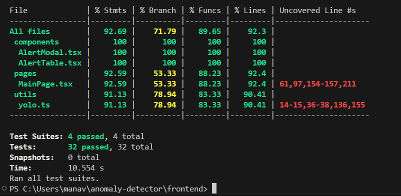
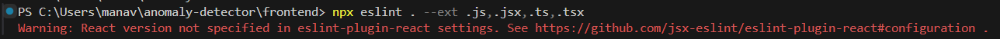

# Automated Anomaly Detection System

## 1. Objective

This project implements an end-to-end anomaly detection system featuring a React frontend and a Node.js backend. Users can upload video clips, which are analyzed in-browser using a pretrained YOLO model to detect anomalies. Alerts are created based on custom rules and stored in AWS RDS. The backend is deployed on AWS EC2.

## 1.1 Frontend Framework

The frontend was creating using React with TypeScript and Material-UI was used for styling components.

## 1.2 Frontend GUI

The frontend GUI has a search page implemented with the ability to filter by searching for key words or selecting a type from the dropdown. The results are dynamically rendered in a structured table that displays each alert's ID, timestamp, type, and message. Users can upload a video, and a video preview is also shown. When an alert is selected from the table, further information about the anomoly is presented.

## 1.3 Backend Framework

The backend was created using Node.js with Express and it is deployed on AWS EC2 using PM2.

## 1.4 Backend Storage

AWS RDS is used to store anomaly alert data. Decoupled CRUD operations are also implemented using REST APIs. The solution for storing frame data  was to save static files on the server. The database stores public URLs pointing to these frame images.


## 1.5 Machine Learning Integration

The system uses a pretrained YOLOv5 object detection model converted to the TensorFlow.js format for in-browser inference. TensorFlow.js executes predictions using either WebAssembly or WebGPU backends for performance. While the Stanford Drone Dataset was initially used for testing, it was difficult to detect anomolies due to the top-down aerial perspective, which significantly reduced detection reliability for objects like cars and people. Despite attempts to lower confidence thresholds and inspect prediction outputs, the model consistently failed to detect key objects in the dataset. To validate inference capability, personal videos featuring a motorcycle and a car were recorded and successfully detected by the system which can be seen below:


## 1.6 Anomaly Detection System

Users can upload video clips from the frontend. The custom anomoly detections rules are Type A: too many people, Type B: Vehicle in frame, and Type C:  High-confidence object (car/bus/bike)

## 2. Non-Functional Requirements

### 2.1 Unit Testing

All components were tested using Jest and the Target of 80%+ code coverage was met. See below for the code coverage:


### 2.2 Code Quality

All ESLint checks passed however a minor warning related to the unspecified React version in the ESLint plugin was observed. This does not affect functionality so it was ignored. See below for proof:



### 2.3 AWS Implementation

The Backend is hosted on AWS EC2 (Free Tier) and the Database is hosted on AWS RDS (Free Tier)

## 3. Vibe Coding and AI-Assisted Development

### 3.1 Coding with LLMs

ChatGPT and GitHub Copilot were used for AI-assisted development. Prompt engineering was used to iteratively develop, debug, and refine components


## 4. Submission

- Source code available at: [\[GitHub Repo URL\]](https://github.com/manav2002/anomaly-detector)
- Prompts used with ChatGPT are located in the `/prompts` directory
- Reviewer credentials:
  - `.env` file is included in email.


## Running Project Locally:

To run this project locally:

1. **Clone the repository:**
   ```bash
   git clone https://github.com/manav2002/anomaly-detector.git
   ```

2. **Navigate into the frontend folder and install dependencies:**
   ```bash
   cd anomaly-detector/frontend
   npm install
   ```

3. **Start the frontend development server:**
   ```bash
   npm run dev
   ```

4. **Open a new terminal, navigate to the backend folder, and install dependencies:**
   ```bash
   cd ../backend
   npm install
   ```

   #### 4.1 Note on backend - You should not need to run the backend manually, as it is already deployed and running on AWS EC2. However, instructions are included above in case you want to test the project locally.

5. **Set up environment variables:**
   Create a `.env` file in the `backend/` directory using the `.env` file provided in email as a reference.

6. **Start the backend server:**
   ```bash
   npm start
   ```
   (If running on EC2, use `pm2 start server.js`.)

    #### 6.1 Note on backend - You should not need to run the backend manually, as it is already deployed and running on AWS EC2. However, instructions are included above in case you want to test the project locally.

7. **View the app:**
   Open `http://localhost:5173` in your browser (or your EC2 public IP if deployed).

### TLDR - Clone repo, navigate into frontend folder and install dependencies, run the frontend server, DONE - no need to run backend manually. 
